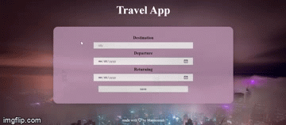

# Travel App 

# Project Summary
 This application allows you to add a trip by obtaining the city , departure date , and returning date from you and display trip information: 
 1- City and country name 
 2- Country flag 
 3- City image  
 4- Length of the trip  
 5- Weather information 
 6- Weather icon 

 # Other requirements
 1- Add end date and display length of trip 
 2- Allow the user to remove the trip 
 3- Incorporate icons into forecast

 # Running the project
 1- Run npm install to install dependencies 
 2- Run npm run build-prod to create dist folder 
 3- Start the server with npm run start 
 4- build-prod: Running on port 8081 
 5- build-dev: Running on port 8080

 # Test the project
 Run npm test 

 # Project demo 
 

